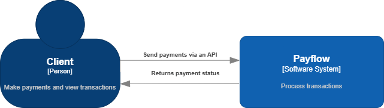
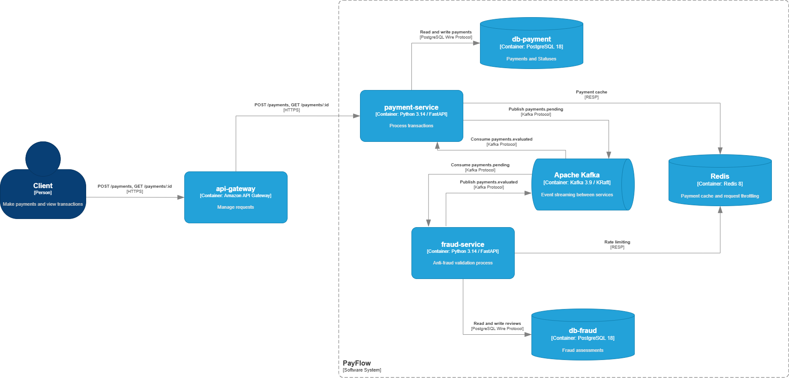
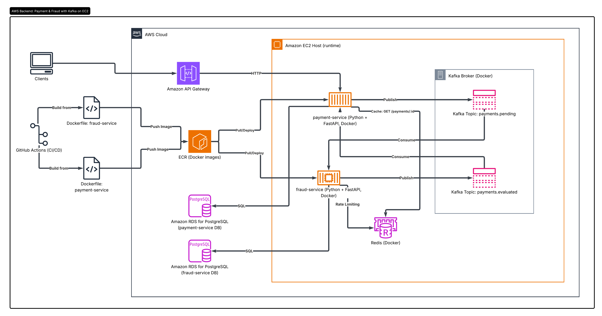

# PayFlow

Backend payment processing system with real-time fraud detection, built to demonstrate proficiency in distributed architectures, event-driven systems, and high-performance backend engineering applied to fintech.

---

## Architecture

PayFlow is composed of two independent microservices that communicate **exclusively through Kafka** — never via direct HTTP calls, never by importing each other's code.

### System Context (C4 L1)



### Container Diagram (C4 L2)



### System Design



### Payment flow

```text
Client
  → Payment Service
      → persists payment in PostgreSQL with status PENDING
      → publishes event to Topic: payments.pending
      → responds to client immediately
          → Fraud Service consumes payments.pending
              → evaluates fraud
              → publishes result to Topic: payments.evaluated
                  → Payment Service consumes payments.evaluated
                      → updates payment status: APPROVED or REJECTED
```

---

## Stack

| Technology           | Version | Role                                          |
|----------------------|---------|-----------------------------------------------|
| Python               | 3.14.4  | Core language                                 |
| FastAPI              | 0.135+  | REST API framework for each microservice      |
| PostgreSQL           | 18      | Primary database (one instance per service)   |
| Apache Kafka         | 3.9     | Event streaming between services (KRaft mode) |
| Redis                | 8       | Payment cache and rate limiting               |
| SQLAlchemy + Alembic | 2.0.49  | Async ORM and versioned migrations            |
| Docker + Compose     | Latest  | Containers and local environment              |
| GitHub Actions       | —       | CI/CD with per-service selective deploy       |
| AWS EC2 + RDS + ECR  | —       | Cloud infrastructure                          |
| pytest               | —       | Unit, integration and API tests               |
| Locust               | —       | Load testing                                  |

---

## Architecture Decisions

### Why two microservices instead of a monolith?

The two services communicate **exclusively through Kafka**. No direct HTTP calls, no shared code, no shared database. Each service owns its own writes. That is what truly decouples them.

If the Fraud Service goes down, events accumulate in Kafka without being lost. When it recovers, it resumes from the last committed offset. During that time, Payment Service keeps accepting payments normally — affected payments remain in `PENDING` state, which is the correct behavior.

### Why Kafka and not a traditional message queue?

Kafka is a persistent event log, not a fire-and-forget queue. This means:

- Events are stored on disk and survive service restarts.
- The Fraud Service can replay events from any offset.
- Horizontal scaling of consumers requires zero code changes.

### Why two separate PostgreSQL instances?

Each service has its own RDS instance. If the Payment Service database goes down, the Fraud Service keeps operating without interruption — and vice versa. That is real fault isolation.

### Why Redis for rate limiting?

Redis `INCR` and `EXPIRE` are individually atomic, but to execute them atomically together a Lua script is used. This prevents a key from being left without a TTL if the process crashes between the two commands. If a user submits more than 3 payments within 60 seconds, the fraud score increases automatically.

### Why Redis for caching?

Redis caching reduces the read load on PostgreSQL in the event of frequent requests. When a user requests to view their payment multiple times, we cannot process each request by querying the database directly; therefore, a TTL is applied to that request, and it is served only from the cache. The cache must also be invalidated if, for example, the transaction status changes from “pending” to “approved” or “rejected.”

### Why Hexagonal Architecture?

The domain does not know that Kafka, PostgreSQL, or FastAPI exist. It only knows abstract interfaces called Ports (`IPaymentRepository`, `IEventPublisher`). Adapters are the concrete implementations.

If Kafka is replaced by RabbitMQ tomorrow, only the adapter changes. Domain logic, use cases, and tests remain untouched. This also means unit tests run in milliseconds — no infrastructure required.

---

## Local Setup

> Coming soon — Docker Compose orchestration in progress.

---

## Running Tests

> Coming soon — test suite in progress.
