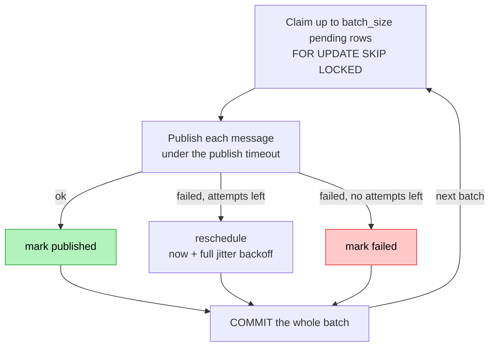
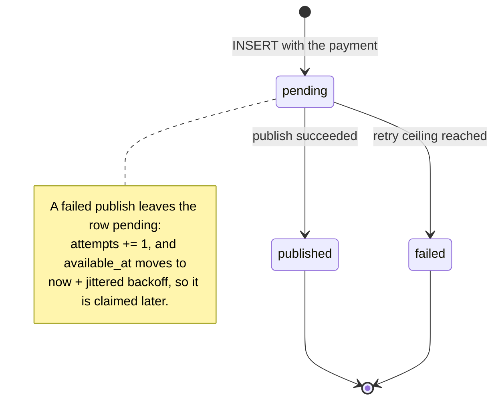

# The transactional outbox

Reference for how `payment.created` leaves the system. For how to run the worker and tune it, see
the [README](../README.md#development).

## Why it exists

Saving a payment and announcing it must either both happen or neither. Publishing to a broker from
inside the request path cannot give that guarantee: the publish can succeed after the database
rolled back, or fail after it committed. So the API never publishes anything — it writes an
`outbox` row in the **same transaction** as the payment, and a separate process drains that table.

## The two paths

Two processes, one database, and the only thing between them is a committed row. The `201` does not
wait for the broker — see the diagram in the [README](../README.md#architecture).

## The relay batch

One batch is one transaction. The row lock is held across the publish — there is no intermediate
`publishing` status to reconcile after a crash, which is the point.

`batch_size`, the publish timeout, the retry ceiling and the backoff bounds are the `OUTBOX_*`
settings; their defaults are listed in the README.

Notes that matter:

- **`SKIP LOCKED`** makes the relay horizontally scalable: a second worker claims different rows.
- **Backoff is exponential with full jitter** — the delay is drawn uniformly from
  `[0, min(cap, base * 2**attempts)]`. The randomness prevents rows that failed together during an
  outage from retrying in lockstep.
- **A batch holds its transaction open while it publishes**, up to
  `batch_size * publish_timeout_seconds` in the worst case. A long transaction pins the xmin horizon
  and delays `VACUUM`, so raise either value knowingly.
- **A shutdown never interrupts a batch.** `SIGINT`/`SIGTERM` stop the loop after the batch in
  flight; a cancellation inside one escapes the claim block, so the whole batch rolls back and every
  row stays `pending`.
- **Delivery is at-least-once.** A crash after the broker accepted a message but before the commit
  re-delivers it. Consumers must deduplicate by `event_id`.

## Row lifecycle

A `failed` row is never claimed again — it is a diagnostic, not a retry queue.

## Where the code lives

Layered like a module, under `app/shared/outbox/`:

| Path | Role |
| --- | --- |
| `domain/ports/` | `OutboxStorePort`, `EventPublisherPort` |
| `domain/backoff.py` | `full_jitter_backoff` |
| `application/relay_outbox_batch_use_case.py` | one batch: claim, publish, record each outcome |
| `infrastructure/persistence/postgres_outbox_store.py` | the claim query and the outcome updates |
| `infrastructure/publishing/logging_event_publisher.py` | the stand-in publisher |
| `infrastructure/relay_worker.py` | `RelaySettings` and the polling loop |

The payment side writes the row: `PostgresPaymentRepository.create_payment` inserts the payment and
its `payment.created` row together.

## The gap

`LoggingEventPublisher` only logs — rows are marked published and delivered nowhere, and the worker
warns about exactly that on boot. No consumer exists, so payments stay `PENDING`. Closing the loop
is one new `EventPublisherPort` implementation plus a consumer; the relay, the backoff and every
test stay untouched. That is what the port is for.
